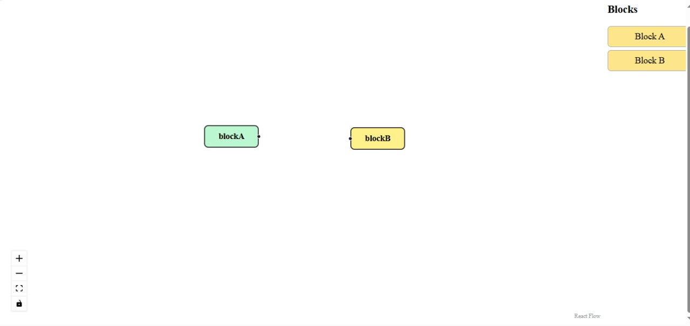
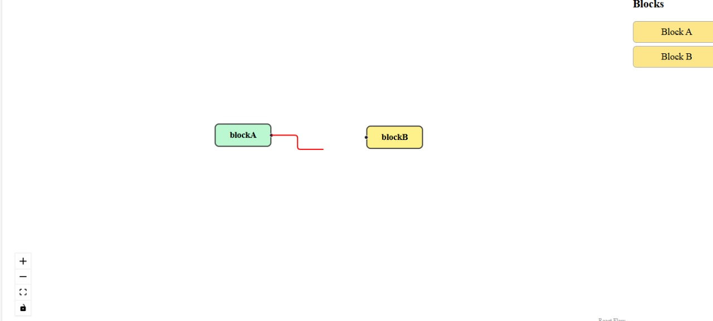
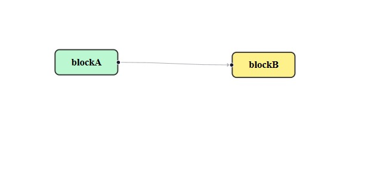
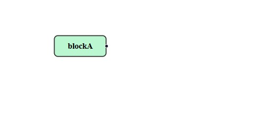

# React Flow Board

A React-based flow board built using [React Flow](https://reactflow.dev/).  
This project supports **drag & drop nodes**, **connect nodes** , **deleting nodes/edges**, and **custom node rendering**.

---

## 🚀 Features
- Drag and drop nodes onto the board
- Connect nodes with edges (with arrows)
- Delete nodes and edges with `Delete` or `Backspace`
- Right-click context menu (prints `Hello World`)
- Custom styled nodes

---

## 🛠️ Tech Stack
- **React.js**
- **React Flow**
- **JavaScript (ES6)**
- **CSS**

---

## 📂 Project Structure


react-flow-board/ 

│── src/

├── components/

    ├── CustomNode.jsx
    
    │── FlowBoard.jsx
    
├── App.js

├── index.js

│── public/

│── package.json

│── README.md

## 🔧 Installation & Setup

1. Clone the repo:
   ```bash
   git clone https://github.com/sivasri9833/react-flow-board.git
   cd react-flow-board
2. Install dependencies:

npm install

3. Start development server:

    npm start

4. Open in browser:

   http://localhost:3000

Block panel and list of draggable blocks:

Created connection:

Connection using arrow and displaying hello world:

Added ability to remove blocks or connections via UI:



